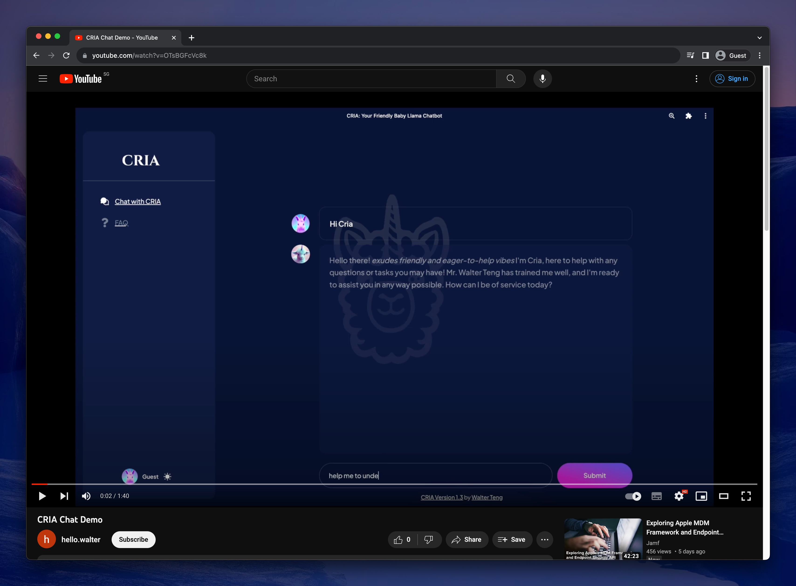

# 🍼🦙 CRIA

Welcome to CRIA, a LLM model series based on [Llama 2-7B](https://github.com/facebookresearch/llama).

## What is CRIA?

> **Hint:** krē-ə plural crias; a baby llama, alpaca, vicuña, or guanaco.

    

With ChatGPT's help, CRIA also stands for **"Crafting a Rapid prototype of an Intelligent llm App using open source resources"**. This encapsulates the objective of this project perfectly.

Additionally, akin to a baby llama in nature, CRIA pays homage to its foundational model, Meta's Llama-2 7B Large Language Model.

## Features

- Demostration of instruction-tuning on latest open source LLM using a custom dataset on a _free colab instance_.
- Utilized FastAPI for efficient model serving and inference deployment.
  - Supports real-time with Server-Sent Events (SSE) for a seamless chat experience.
- Enjoy a modern front-end built with Next.js and Chakra UI.
- Supports both local deployment, and cloud deployment. (Coming Soon!)

   
  <b>Demo:</b> Leveraging on open source resources such as <a href="https://github.com/horizon-ui/chatgpt-ai-template">Horizon AI Template</a>

## What You'll Find Here

In this repository, you'll find:

**Code:** Dive into the technical details of our chatbot implementation, including the training process, API server implementation, the integration of Next.js for the user interface, and more.

**Documentation:** Detailed documentation to help you understand and replicate the CRIA setup, from model selection to deployment considerations.

**Demo:** Access a live demo showcasing CRIA in action.

## Model History

| HuggingFace Model                                                                                                                                                   | Model Type    | Base Model                                                                                    | Dataset                                                                                                                | Colab                                                                                                                                                                                                                                                                                                           | Status       |
| ------------------------------------------------------------------------------------------------------------------------------------------------------------------- | ------------- | --------------------------------------------------------------------------------------------- | ---------------------------------------------------------------------------------------------------------------------- | --------------------------------------------------------------------------------------------------------------------------------------------------------------------------------------------------------------------------------------------------------------------------------------------------------------- | ------------ |
| [cria-llama2-7b-v1.3](https://huggingface.co/davzoku/cria-llama2-7b-v1.3),   [cria-llama2-7b-v1.3_peft](https://huggingface.co/davzoku/cria-llama2-7b-v1.3_peft) | Merged / PEFT | [NousResearch/Llama-2-7b-chat-hf](https://huggingface.co/NousResearch/Llama-2-7b-chat-hf)     | [mlabonne/CodeLlama-2-20k](https://huggingface.co/datasets/mlabonne/CodeLlama-2-20k)                                   |   | Latest       |
| cria-llama2-7b-v1.1, cria-llama2-7b-v1.2                                                                                                                            | Merged / PEFT | [TinyPixel/Llama-2-7B-bf16-sharded](https://huggingface.co/TinyPixel/Llama-2-7B-bf16-sharded) | [n3rd0/DreamBook_Guanaco_Format](https://huggingface.co/datasets/n3rd0/DreamBook_Guanaco_Format)                       | N.A.                                                                                                                                                                                                                                                                                                            | Experimental |
| cria-llama2-7b-v1.0                                                                                                                                                 | PEFT          | [TinyPixel/Llama-2-7B-bf16-sharded](https://huggingface.co/TinyPixel/Llama-2-7B-bf16-sharded) | [Elliot4AI/dolly-15k-chinese-guanacoformat](https://huggingface.co/datasets/Elliot4AI/dolly-15k-chinese-guanacoformat) | N.A.                                                                                                                                                                                                                                                                                                            | Experimental |

## Documentation

### Setup

The instructions to run the various components, such as the API server and frontend interface, can be found at [/docs/setup.md](/docs/setup.md).

### Deployment

The instructions to deploy the API server and frontend on the cloud, can be found at [/docs/deployment.md](/docs/deployment.md).

### Slides

CRIA v1.3 was first presented in a private session on 18 Aug 2023. The slides is publicly available [here](https://docs.google.com/presentation/d/1HdHfl0XiGIvRd-R3AHTEZn8Ee9ibFTp_Dv-q1S5SgrQ/edit?usp=sharing).

### Architectural Overview

The overview of the project can be found at [/docs/architecture.md](/docs/architecture.md).

### Architectural Decision Records (ADR)

Please refer to the [/docs/adr/](/docs/adr/) folder for the detailed information on the list of design decisions made so far.

### Model Evaluation

The preliminary model evaluation can be be found at [/docs/model-eval/](/docs/model-eval/) folder.

## References

### Guides / Tutorials / Discussions

- [ML Blog - Fine-Tune Your Own Llama 2 Model in a Colab Notebook](https://mlabonne.github.io/blog/posts/Fine_Tune_Your_Own_Llama_2_Model_in_a_Colab_Notebook.html)
- [Fine-tune Llama 2 in Google Colab.ipynb - Colaboratory](https://colab.research.google.com/drive/1PEQyJO1-f6j0S_XJ8DV50NkpzasXkrzd?usp=sharing)
- [Making LLMs even more accessible with bitsandbytes, 4-bit quantization and QLoRA](https://huggingface.co/blog/4bit-transformers-bitsandbytes)
- [bnb-4bit-training.ipynb - Colaboratory](https://colab.research.google.com/drive/1VoYNfYDKcKRQRor98Zbf2-9VQTtGJ24k?usp=sharing)
- [🐐Llama 2 Fine-Tune with QLoRA [Free Colab 👇🏽] - YouTube](https://www.youtube.com/watch?v=eeM6V5aPjhk)
- [Fine-Tune Large LLMs with QLoRA (Free Colab Tutorial) - YouTube](https://www.youtube.com/watch?v=NRVaRXDoI3g)
- [LLaMA2 for Multilingual Fine Tuning? - YouTube](https://www.youtube.com/watch?v=ThKWQcyQXF8)
- [How to Tune Falcon-7B With QLoRA on a Single GPU - YouTube](https://www.youtube.com/watch?v=AXG7TA7vIQ8)
- [🦙Llama 2 Fine-Tuning with 4-Bit QLoRA on Dolly-15k [Free Colab 🙌] - YouTube](https://www.youtube.com/watch?v=o5bU1H-6TqM)
- [Fine-Tune Your Own Llama 2 Model in a Colab Notebook | Towards Data Science](https://towardsdatascience.com/fine-tune-your-own-llama-2-model-in-a-colab-notebook-df9823a04a32)

### Datasets

- [mlabonne/CodeLlama-2-20k](https://huggingface.co/datasets/mlabonne/CodeLlama-2-20k)
- [n3rd0/DreamBook_Guanaco_Format](https://huggingface.co/datasets/n3rd0/DreamBook_Guanaco_Format)
- [Elliot4AI/dolly-15k-chinese-guanacoformat](https://huggingface.co/datasets/Elliot4AI/dolly-15k-chinese-guanacoformat)

### Models

- [NousResearch/Llama-2-7b-chat-hf](https://huggingface.co/NousResearch/Llama-2-7b-chat-hf)
- [TinyPixel/Llama-2-7B-bf16-sharded](https://huggingface.co/TinyPixel/Llama-2-7B-bf16-sharded)
