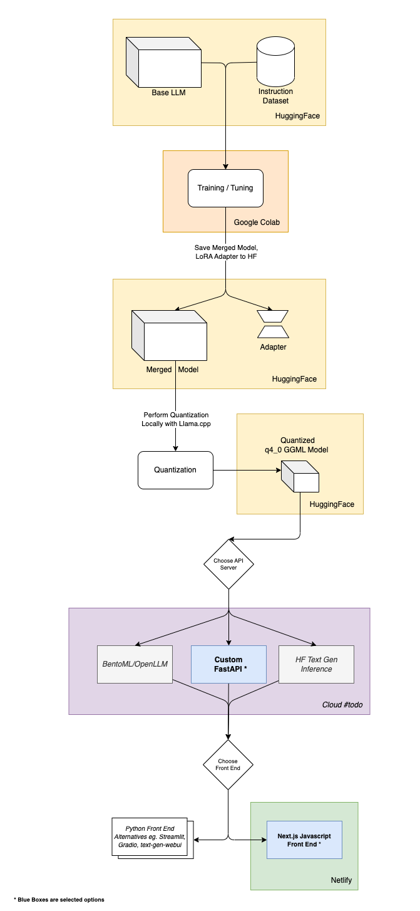

# Architecture

This document describes the high-level architecture of CRIA. This document is based on [ARCHITECTURE.md](https://matklad.github.io/2021/02/06/ARCHITECTURE.md.html)

## Overview

The architectural diagram of CRIA is presented below. The emphasis of this project is on the utilization of **free and open source resources** to fine tune our own Large Language Model (LLM) and serve it locally or on the cloud.

The high-level overview is as such:

1. **Base Model and Dataset Selection:** We selected a suitable base model and instruction dataset from [Hugging Face (HF)](https://huggingface.co/).
2. **Supervised Fine Tuning (SFT) on Colab:** The base model and dataset are loaded into a free Colab instance and Supervised Fine Tuning (SFT) is performed using HF libraries.
3. **Training Outputs:** The training outputs are the LoRA adapter and a merged model, which simplifies deployment. These are uploaded to HF.
4. **Quantization via llama.cpp:** The merged model is quantized to 4 bits utilizing [llama.cpp](https://github.com/ggerganov/llama.cpp), following which the quantized model is uploaded to HF.
5. **API Serving through FastAPI:** FastAPI is used to build APIs for serving to the client application. This API server can dockerized and hosted locally or on the cloud. This server can be dockerized for local or cloud-based hosting.
6. **User Interface with Next.js:** Concluding the process, a Next.js frontend application ingests with the API into an user-friendly interface. This Next.js application is served on [Netlify](https://www.netlify.com/).

\_For the detailed information on design decisions made so far, please refer to the `/docs/adr` folder.

