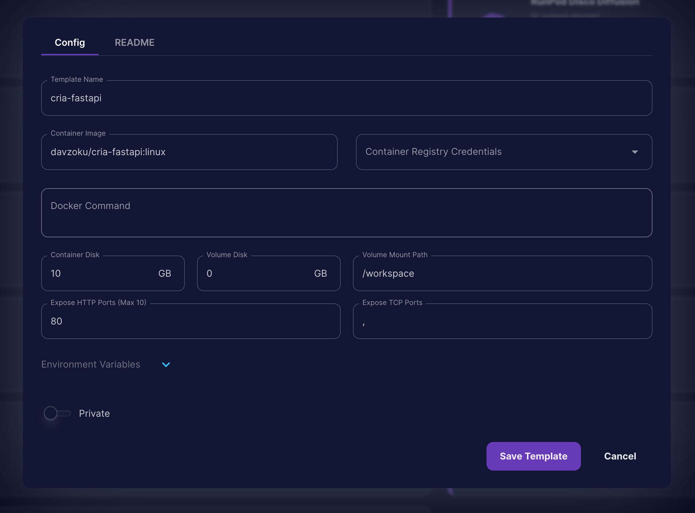

# Deployment Instructions

This documents covers the deployment instructions to get this project up on cloud hosting.

## API Server

We will see [Runpod](https://www.runpod.io/) to host our FastAPI server for as low as $0.34/hr.

1. Build an deployment docker image for Linux environment eg.

```
docker build -t "davzoku/cria-fastapi:linux" -f fastapi.Dockerfile --platform linux/amd64 .
```

2. Sign up / Login to [Docker Hub](https://hub.docker.com/).

3. Push the deployment image to Docker Hub.

```
docker push davzoku/cria-fastapi:linux
```

4. Sign up / Login to Runpod.

5. Create a new custom template on [Pod Templates](https://www.runpod.io/console/user/templates) page using the config similar to the following:



    - use the docker image name that you pushed to Docker Hub
    - make sure you have allocated enough container disk space (> docker image size)
    - make sure you expose the correct HTTP port for the API call. eg. 80.

## Frontend

We will use [Netlify](https://www.netlify.com/) to host the Next.js frontend application for free.

1. Sign up / Login to Netlify.

2. Import an existing project from Github to Netlify

3. Follow the instructions to deploy the frontend. More detailed instructions will be provided in the future.

4. Remember to set up the environment variables as per the `.env` file.
