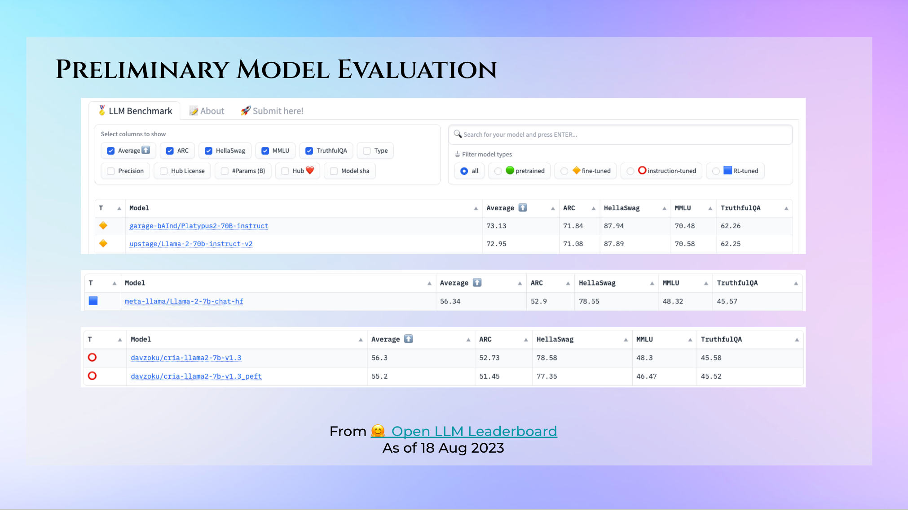

# Model Evaluation of v1.3

Given our limited compute capacity, the evaluation of version 1.3 relies on free online resources, such as the HuggingFace Open LLM Leaderboard.

## 🤗 Open LLM Leaderboard

As of 18 Aug 2023, this is the current benchmarks result for v1.3 against the best open source models on huggingface and CRIA's base model, Llama-2-7b-chat-hf.

